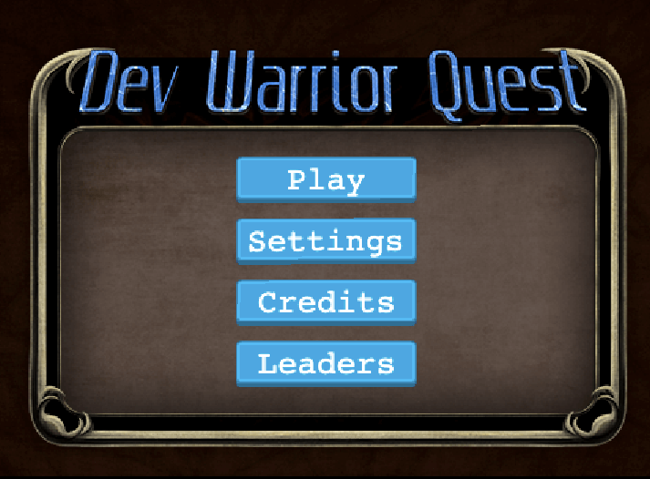
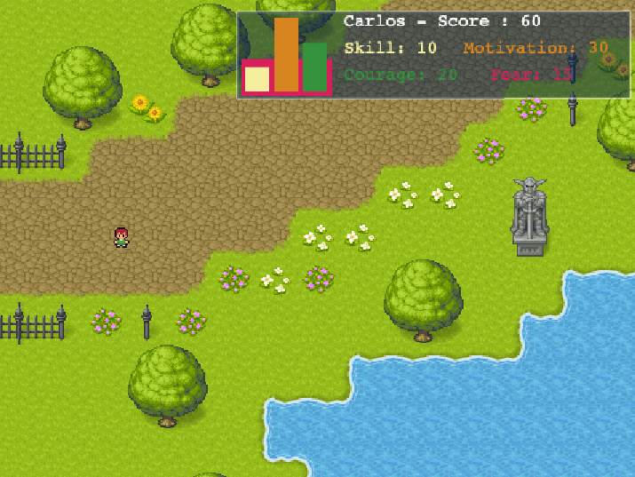
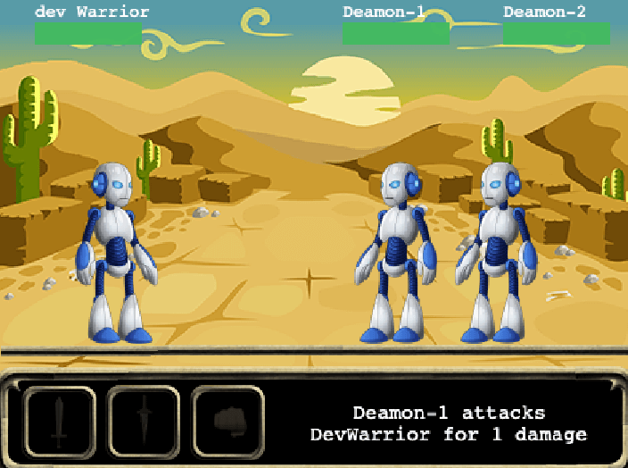
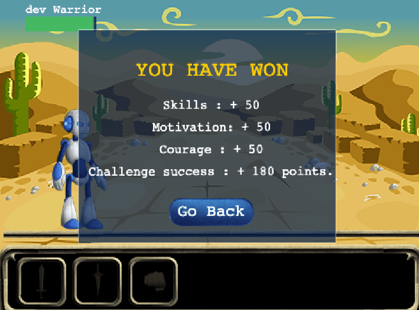

## Turn-Based RPG Video Game, built with Phase 3 Library
---

[](https://app.netlify.com/sites/anriquez-rpg/deploys)

## Project Details - Game Design 
 
- The game was developed following fundamental Game Design principles, applying them, and building a formal Game Design Document. 


## Game Goal

 - The main character, "The Dev Warrior" will go in a hero quest, building skills, courage, and motivation levels to conquer terrifying fear demons, winning the once lost self-confidence back. 
 - Our hero will follow a route that will bring him into four main challenges: he will be confronted with his demons and will need to defeat to continue moving forward.
 - The complete story is an attempt to resemble the path that a wannabe developer will encounter in a never up and down cycle where resilience work and challenges are the primary sources of learning and progress.
 - The DevWorrior comes from a deep dissatisfaction and a painful separation that pushes him into the first hero cycle that can be the one that can change his life forever. 
- Develop resilience muscle to embrace the grind and succeed. "We can only get better if we learn from our failures". It is not about avoiding our fears, but to acknowledge them and build skills, courage, and motivation muscles to take on challenges and become victorious.


# Game Play

## First Minutes 
After all assets are loaded, the player will see the main map screen with the player ready to move. In the screen, the player will observe the main head-up-display with the original score for courage, motivation, skills, and fear. Also, the display would show a mini-map with the indication of where in the map the player is located. In the first seconds, the player will need to dodge the virus and ghosts bouncing on the screen, although at this stage are low in the count. 

The player will then initiate its path, and almost immediately, it will engage in the first fight.

## Game Flow

Initial Screen: The player is greeted to the 'Dev Warrior Quest' initial screen, asking for the player name.


The Main Menu will show afterward, presenting all available options.



- Main map screen 



 

- Challenge Screen

During the map path, the DevWarrior will encounter challenges. Each challenge will show a particular scene where the warrior will need to fight against its demon fears to conquer a specific skill or project. In turn, each fear dragon will hit the warrior, increasing his fear and stress levels. 



- On successful battles, the warrior would earn the skill of the challenge and increase its current motivation and courage levels. The player can decide to leave the challenge at any time, although a courage penalization and an increase of its fears level will be applied to his score.

- At the end of the cycle, the player will find or not (depending on the skill levels achieved and a little luck) the chance to get into a Job-Offer Application challenge. 

## Game Control

- This single-player game can be controlled using the keyboard arrows. The player can move across a big map that describes a path across the terrain with a circular shape with obstacles. 

- This circular shape represents the DevWarrior hero cycle. During the travel across the cycle, the DevWarrior will experience a strong fight between confidence and competence in the path of becoming job-ready for the market. 

- Challenges will come easier during the "honeymoon" section, getting harder from the "cliff of confusion onwards" getting into its peak during the "desert of despair" section. New skills will become handy during the "uprising of awesome" section until the player finally returns to the beginning of the map after mastering the current circle.

## Victory Conditions



The overall objective is for the player to make sure fear levels are compensated by courage, skills, and motivation levels. The player will lose the match if, at any point, this balance is not kept at a minimum with F >= S+C+M.

On every won challenge, the player will generally increase its skill, courage, and motivation levels. Fear can only increase. The trick here is not to reduce anxiety, but even with fear, go into the challenges and play the game to enhance any other dev warrior treat value.

# Live Link

[Netlify Live Link](https://anriquez-rpg.netlify.app/)

## Built With

- HTML/CSS, Javascript, Webpack, NPM, yarn.
- Babel
- ESlint, Stylelint, Jest
- Phaser 3
- VSCode
- Netlify

## Getting Started


To get a local copy up and running, follow these simple example steps.

### Prerequisites
- To install the app in your system, make sure you have node/npm installed. [get npm](https://www.npmjs.com/get-npm)

### Setup
- Clone the repository in your system by using: 

``` git clone  ```

### Install
- Next step is to CD into the local repository and run:

``` $ npm install ```
``` $ yarn build ```

## Test
The repository currently contains 26 tests that have driven the score calculation main method development. At the repository root,  run the following command to execute the available tests:

``` yarn test ```

## Author

👤 ***Carlos Anriquez***

- Github: [@canriquez](https://github.com/canriquez)
- Twitter: [@cranriquez](https://twitter.com/cranriquez)
- Linkedin: [linkedin](https://www.linkedin.com/in/carlosanriquez/)
- Portfolio: [carlosanriquez.com](https://www.carlosanriquez.com)

## 🤝 Contributing

Contributions, issues, and feature requests are welcome!

Feel free to check the [issues page](issues/).

## Show your support

Give a ⭐️ if you like this project!

## Acknowledgments

- Family, always my family.
- The Beagles!

## 📝 License

This project is [MIT](./LICENSE) licensed.
